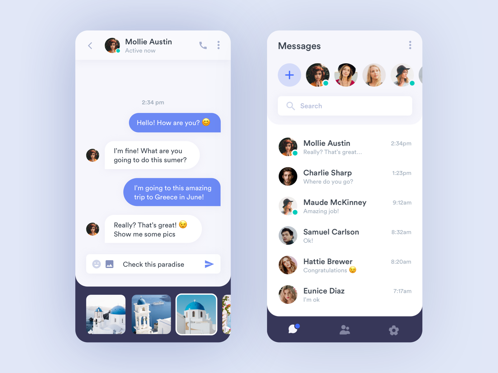

# kaur_sabnit_chatApp

### Table of Content

* Introduction
* Explaination
* References
* Softwares
* Author

## Introduction

* Make a new chat application and design it the way they desire. Moreover, make sure you have a index and chat page where one can login and then chat.

* Furthermore, try to record time when user got message and when he replied. Both way has to be different colors.

## Explaination!
 * Basically this is a chat application.

 * This is my Doc with steps and my story [click here](https://docs.google.com/document/d/121zWUKrqFffpem8MESZtGw_qwoM6dcxuAg2ZJ5uFSLo/edit?usp=sharing)

## Software
* Github
* Visual Studio Code
* X code
* Terminal
* Heroku
* Postman

## References
* Youtube
* Online websites
* Class Videos

## Author
* Sabnit Kaur

### License
Copyright (c) 2020 Fanshawe
College All Rights Reserved.

